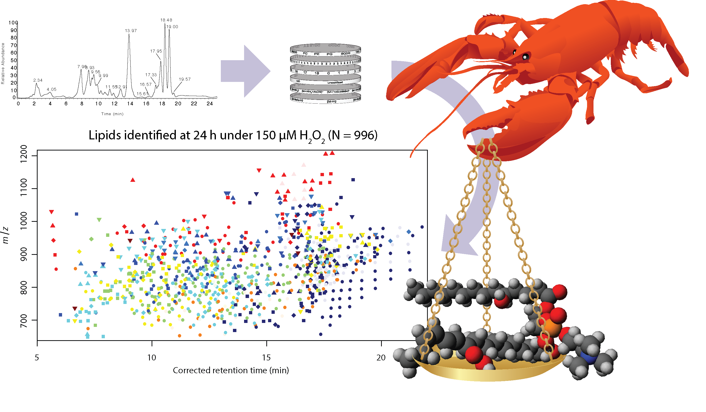

# LOBSTAHS

This is the home of the R package **LOBSTAHS**, developed in the Van Mooy Lab at Woods Hole Oceanographic Institution. LOBSTAHS (Lipid and Oxylipin Biomarker Screening Through Adduct Hierarchy Sequences) is a multifunction package for screening, annotation, and putative identification of mass spectral features in large, HPLC-MS lipid datasets. LOBSTAHS provides functions for easy creation of custom databases containing entries for a wide range of lipids, oxidized lipids, and oxylipins. Databases are generated using an automated computational approach based on structural criteria specified by the user in simple text tables/spreadsheets. The package's default databases contain roughly 18,000 compounds. Installation instructions and some general information about LOBSTAHS are given below. The current production version of LOBSTAHS is available via [Bioconductor](http://bioconductor.org/packages/LOBSTAHS).

The primary repository at [https://github.com/vanmooylipidomics/LOBSTAHS](https://github.com/vanmooylipidomics/LOBSTAHS) will **always** contain the latest development version of LOBSTAHS. Changes are pushed as frequently as possible to Bioconductor, where they will appear in the read-only mirror at [https://github.com/Bioconductor-mirror/LOBSTAHS](https://github.com/Bioconductor-mirror/LOBSTAHS).

A [comprehensive vignette](https://github.com/vanmooylipidomics/LOBSTAHS/blob/master/vignettes/LOBSTAHS.Rmd) contains detailed, step-by-step user instructions and examples of package functions illustrated with a model dataset. 

LOBSTAHS is copyright (c) 2015-2017, by the following current and former members of the Van Mooy Laboratory group at Woods Hole Oceanographic Institution: [James R. Collins](http://jamesrco.github.io), Bethanie R. Edwards, Helen F. Fredricks, and Benjamin A.S. Van Mooy. All accompanying written materials are copyright (c) 2015-2017, James R. Collins. LOBSTAHS is provided under the [GNU General Public License](https://github.com/vanmooylipidomics/LOBSTAHS/blob/master/LICENSE) and subject to terms of reuse as specified therein.

<h2>Citations</h2>

LOBSTAHS is described in:

Collins, J.R., B.R. Edwards, H.F. Fredricks, and B.A.S. Van Mooy. 2016. LOBSTAHS: An adduct-based lipidomics strategy for discovery and identification of oxidative stress biomarkers. *Analytical Chemistry* **88**:7154-7162; [doi:10.1021/acs.analchem.6b01260](http://dx.doi.org/10.1021/acs.analchem.6b01260)

Adduct hierarchy and retention time window data for lipid classes BLL, PDPT, vGSL, sGSL, hGSL, hapGSL, and hapCER (package versions ≥ 1.1.2) are as described in:

Hunter J.E., M.J. Frada, H.F. Fredricks, A. Vardi, and B.A.S. Van Mooy. 2015. Targeted and untargeted lipidomics of *Emiliania huxleyi* viral infection and life cycle phases highlights molecular biomarkers of infection, susceptibility, and ploidy. *Frontiers in Marine Science* **2**:81; [doi:10.3389/fmars.2015.00081](http://dx.doi.org/10.3389/fmars.2015.00081)

and 

Fulton, J.M., H.F. Fredricks, K.D. Bidle, A. Vardi, B.J. Kendrick, G.R. DiTullio, and B.A.S. Van Mooy. 2014. Novel molecular determinants of viral susceptibility and resistance in the lipidome of *Emiliania huxleyi*. *Environmental Microbiology* **16**(4):1137-1149; [doi:10.1111/1462-2920.12358](http://dx.doi.org/10.1111/1462-2920.12358)

<h2>Installation</h2>

<h3>Install current production version</h3>

Users can the [current production version of LOBSTAHS](http://bioconductor.org/packages/LOBSTAHS) from Bioconductor by following the [directions here](http://bioconductor.org/packages/LOBSTAHS) (under "Installation"). The Bioconductor installation function will prompt you to install the latest versions of some other packages on which LOBSTAHS depends.

Users are also encouraged to [download the PtH2O2lipids data package](http://bioconductor.org/packages/PtH2O2lipids), which can be used for familiarization with the software.

<h3>Install "no warranties" development version with latest features</h3>

Following these directions, you will install the latest version of the software (including the latest default databases) from the files present in this GitHub repository. Some features may be unstable.

**Install dependencies**

```R

source("http://bioconductor.org/biocLite.R")
biocLite("CAMERA")
biocLite("xcms")

```

**Install RTools**

For windows:
Download and install RTools from [http://cran.r-project.org/bin/windows/Rtools/](http://cran.r-project.org/bin/windows/Rtools/)

For Unix:
Install the R-development-packages (r-devel or r-base-dev)

Install packages needed for installation from Github:

```R

install.packages("devtools")

```

**Install development version of LOBSTAHS from the GitHub repository**

```R

library("devtools")
install_github("vanmooylipidomics/LOBSTAHS") 

```

<h2>LOBSTAHS dataset preparation in xcms and CAMERA</h2>

See [this comprehensive vignette](https://github.com/vanmooylipidomics/LOBSTAHS/blob/master/vignettes/LOBSTAHS.Rmd) for a much more detailed treatment of package functionality.

HPLC-MS data must be assembled into a CAMERA xsAnnotate object prior to analysis with LOBSTAHS. Scripts are provided in the [Van Mooy Lab Lipidomics Toolbox](https://github.com/vanmooylipidomics/LipidomicsToolbox) for preparing HPLC-ESI-MS data from an Orbitrap Exactive mass spectrometer in [**xcms**](https://bioconductor.org/packages/release/bioc/html/CAMERA.html) and then [**CAMERA**](https://bioconductor.org/packages/release/bioc/html/CAMERA.html). Or, the user can use his/her own implementation of xcms and CAMERA. We have successfully used the [IPO](https://github.com/glibiseller/IPO/) package to optimize xcms and CAMERA settings for a variety of datasets.

<h2>In silico database generation</h2>

*In silico* data for a wide range of lipids, oxidized lipids, and oxylipins are generated from user-supplied structural criteria using the database generation function `generateLOBdbase()`. The function pairs these *in silico* data with empirically-determined adduct ion abundance rankings for the major lipid classes. Users can generate their own matrices of structural property ranges to be considered during a `generateLOBdbase()` simulation using the Microsoft Excel spreadsheet templates provided in https://github.com/vanmooylipidomics/LOBSTAHS/tree/master/inst/doc/xlsx. (Users should generate .csv files from this Excel spreadsheets.) Ranges of values can be specified for: 

   * oxidation state,
   * total acyl carbon chain length, and
   * degree of acyl carbon chain unsaturation (i.e., number of double bonds)

Alternatively, users may load the LOBSTAHS default databases. These contain entries for a wide range of intact polar diacylglycerols (IP-DAG), triacylglycerols (TAG), polyunsaturated aldehydes (PUAs), free fatty acids (FFA), and common photosynthetic pigments. In addition, the latest LOBSTAHS release includes support for lyso lipids under an "IP_MAG" species class and certain glycosphingolipids, ceramides, betaine-like lipids (BLL), and quinones. Functionality for other lipid classes is added regularly. The default databases (as of January 23, 2017) include 18,067 and 15,404 unique compounds that can be identifed in positive and negative ionization mode data, respectively. 

<h2>Identification, screening, and annotation using orthogonal criteria</h2> 

The function `doLOBscreen()` is then used to assign putative compound identities from these *in silico* databases to peakgroups in any high-mass accuracy dataset that has been processed using [xcms](https://bioconductor.org/packages/release/bioc/html/CAMERA.html) and [CAMERA](https://bioconductor.org/packages/release/bioc/html/CAMERA.html). doLOBscreen then applies a series of user-selected orthogonal screening criteria based on

   * adduct ion formation patterns,
   * chromatographic retention time, and
   * fatty acid chain length (i.e., even-over-odd preference in eukaryotes for total number of acyl carbon atoms),

to evaluate and assign confidence scores to this list of preliminary assignments. During the screening routine, `doLOBscreen()` rejects assignments that do not meet the specified criteria, identifies potential isomers and isobars, and assigns a variety of annotation codes to assist the user in evaluating the accuracy of each assignment. Results can be extracted and/or exported to file using the `getLOBpeaklist()` function.

<h2>Example dataset</h2> 

The package [**PtH2O2lipids**](https://github.com/vanmooylipidomics/PtH2O2lipids/) contains a example dataset with which users can familiarize themselves with LOBSTAHS. The dataset contains both a CAMERA "xsAnnotate" object and the LOBSTAHS "LOBSet" generated from it using `doLOBscreen()`. Processing of the dataset is described in: Collins, J.R., B.R. Edwards, H.F. Fredricks, and B.A.S. Van Mooy. 2016. "LOBSTAHS: An adduct-based lipidomics strategy for discovery and identification of oxidative stress biomarkers." *Analytical Chemistry* **88**:7154-7162; [doi:10.1021/acs.analchem.6b01260](http://dx.doi.org/10.1021/acs.analchem.6b01260). **Please note** that lipid identities were assigned to the PtH2O2lipids dataset using an earlier version of the LOBSTAHS database, which included many fewer compounds than the current version.

<h2>Code used to generate figures in Collins et al. LOBSTAHS manuscript</h2>

Scripts used to generate the figures and many of the tables in the above referenced manuscript can be found at https://github.com/jamesrco/LipidomicsDataViz/tree/master/LOBSTAHS

LOBSTAHS is maintained by [Jamie Collins](https://jamesrco.github.io) and collaborators in the [Van Mooy Lab](https://github.com/vanmooylipidomics) at WHOI.
