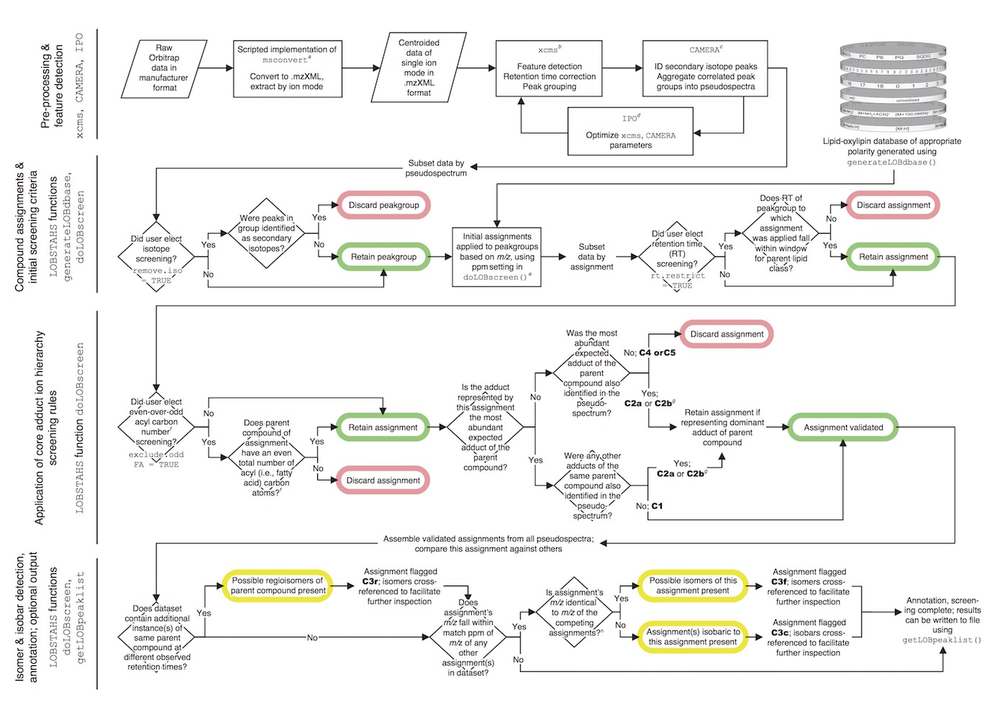
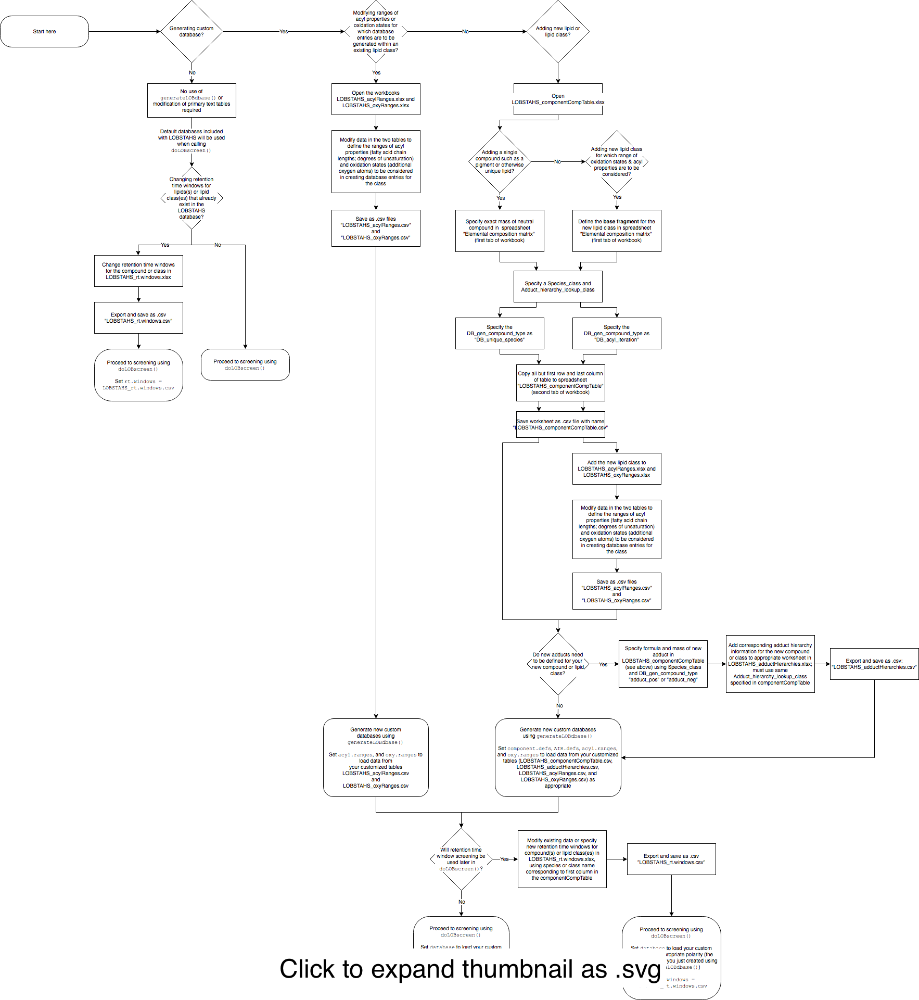
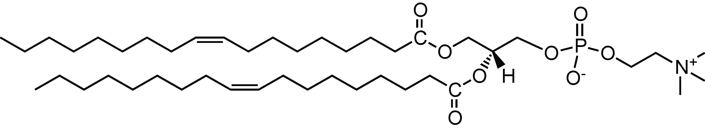
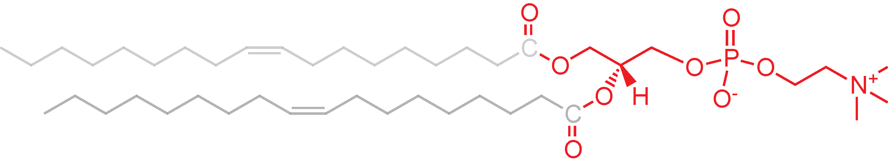
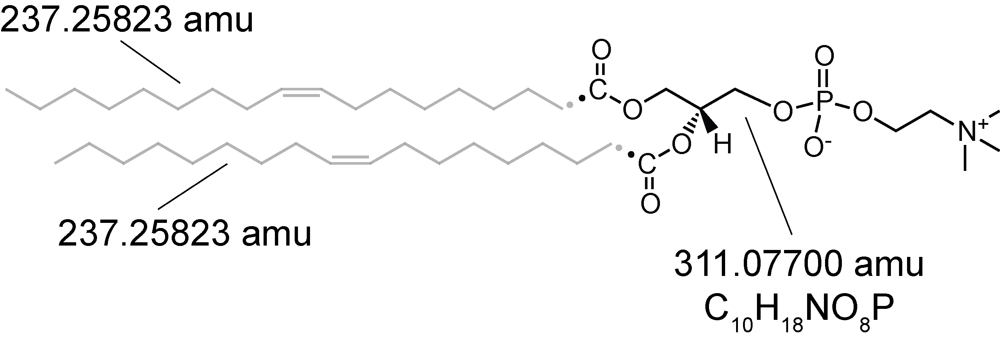
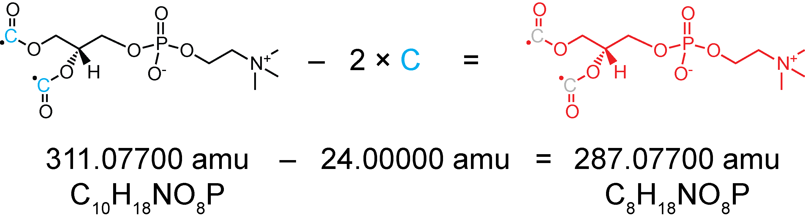

## Introduction

This document describes the purpose and use of the R-package **LOBSTAHS: Lipid and Oxylipin Biomarker Screening through Adduct Hierarchy Sequences**. The package is described in Collins et al. 2016.<sup>[1](#note1)</sup> In the sections below, LOBSTAHS package functions are applied to a model dataset using example code. LOBSTAHS requires the additional packages [xcms](https://bioconductor.org/packages/release/bioc/html/xcms.html)<sup>[2](#note2)</sup> and [CAMERA](https://bioconductor.org/packages/release/bioc/html/CAMERA.html)<sup>[3](#note3)</sup>; the model dataset, consisting of lipid data from cultures of the marine diatom *Phaeodactylum tricornutum*, is contained in the R data package [PtH2O2lipids](https://github.com/vanmooylipidomics/PtH2O2lipids).

## Purpose

LOBSTAHS contains several functions to help scientists discover and identify lipid and oxidized lipid biomarkers in HPLC-MS data that have been pre-processed with the popular R packages [xcms](https://bioconductor.org/packages/release/bioc/html/xcms.html) and [CAMERA](https://bioconductor.org/packages/release/bioc/html/CAMERA.html). First, LOBSTAHS uses exact mass to make initial compound assignments from a set of customizable onboard databases. LOBSTAHS allows users to easily generate custom databases containing entries for a wide range of lipids, oxidized lipids, and oxylipins; these are created using an automated, iterative computational approach based on structural criteria specified by the user in simple text tables/spreadsheets. After database identification, a series of orthogonal screening criteria are applied to refine and winnow the list of assignments. A basic workflow based on xcms, CAMERA, and LOBSTAHS is illustrated in the schematic. Each step in the figure is described in detail in the following paragraphs.



## Installing the LOBSTAHS package

### Install current production version

Users can the [current production version of LOBSTAHS](http://bioconductor.org/packages/LOBSTAHS) from Bioconductor by following the [directions here](http://bioconductor.org/packages/LOBSTAHS) (under "Installation"). The Bioconductor installation function will prompt you to install the latest versions of some other packages on which LOBSTAHS depends.

Users are also encouraged to [download the PtH2O2lipids data package](http://bioconductor.org/packages/PtH2O2lipids), which can be used for familiarization with the software.

### Install "no warranties" development version with latest features

Following these directions, you will install the latest version of the software from the files present in this GitHub repository. Some features may be unstable.

##### Install dependencies:

```{r, eval = FALSE}
source("http://bioconductor.org/biocLite.R")
biocLite("CAMERA")
biocLite("xcms")
```

##### Install RTools:

For windows:
Download and install RTools from [http://cran.r-project.org/bin/windows/Rtools/](http://cran.r-project.org/bin/windows/Rtools/)

For Unix:
Install the R-development-packages (r-devel or r-base-dev)

##### Install packages needed for installation from Github:

```{r, eval = FALSE}
install.packages("devtools")
```

##### Install LOBSTAHS:

```{r, eval = FALSE}
library("devtools")
install_github("vanmooylipidomics/LOBSTAHS", build_vignettes = TRUE) 
```

The `build_vignettes = TRUE` argument is required if rendering of the full vignette is desired (recommended). `install_github()` does not render vignettes by default.

##### Install 'PtH2O2lipids,' containing example data & precursor xsAnnotate object:
```{r, eval = FALSE}
## install dataset 'PtH2O2lipids'
## see LOBSTAHS documentation for examples 

install_github("vanmooylipidomics/PtH2O2lipids")
```


## "Operating instructions," part 1: Pre-processing

### Acquisition of HPLC-MS data suitable for LOBSTAHS

Data for LOBSTAHS should be acquired using a mass spectrometer with sufficiently high mass accuracy and resolution. Suitable MS acquisition platforms with which LOBSTAHS has been tested include Fourier transform ion cyclotron resonance (FT-ICR) and Orbitrap instruments. A quadrupole time-of-flight (Q-TOF) instrument could also be used if it possessed sufficient mass accuracy (i.e., < 5-7 ppm). While the software will accept any HPLC-MS data as input, insufficient mass accuracy and resolution will produce results with large numbers of database matches for each feature that cannot be distinguished from each other.

### File conversion

After acquisition, each data file should be converted from manufacturer to open source (.mzXML) format in centroid (not profile) mode. If data were acquired on the instrument using ion mode switching, the data from each ionization mode (i.e., polarity) must also be extracted into a separate file. The [msConvert tool](http://proteowizard.sourceforge.net/tools/msconvert.html) (part of the ProteoWizard toolbox) can be used to accomplish these tasks. msConvert commands can be executed with either the provided GUI or at the command line; however, conversion of manufacuter file formats can only be accomplished using the Windows installation. An R script ([Exactive_full_scan_process_ms1+.r](https://github.com/vanmooylipidomics/LipidomicsToolbox/blob/master/Exactive_full_scan_process_ms1%2B.r)) for batch conversion and extraction of data files acquired on a Thermo Exactive Orbitrap instrument is provided as part of the [Van Mooy Lab Lipidomics Toolbox](https://github.com/vanmooylipidomics/LipidomicsToolbox). This vignette is not intended as a comprehensive guide to mass spectrometer file conversion; users are encouraged to digest the [msConvert documentation](http://proteowizard.sourceforge.net/tools/msconvert.html). However, assuming a hypothetical data file "Exactive_data.raw" was acquired on an Thermo Orbitrap instrument with ion mode switching, the following code could be within R used to convert and then extract positive and negative mode scans to separate files. (Code presumes you've already installed msConvert.)

#### Initial file conversion; saves converted file to a directory "mzXML_ms1_two_mode":

```{r, eval = FALSE}
system(paste("msconvert Exactive_data.raw --mzXML --filter \"peakPicking true 1-\" -o mzXML_ms1_two_mode -v"))
```

#### Extract positive, negative mode scans, then save in separate directories:

```{r, eval = FALSE}
system(paste("msconvert mzXML_ms1_two_mode/Exactive_data.mzXML --mzXML --filter \"polarity positive\" -o mzXML_ms1_pos_mode -v"))
system(paste("msconvert mzXML_ms1_two_mode/Exactive_data.mzXML --mzXML --filter \"polarity negative\" -o mzXML_ms1_neg_mode -v"))
```

### Pre-processing with xcms

After all data files in a particular dataset have been converted and extracted into files of like polarity, the R-package [xcms](https://bioconductor.org/packages/release/bioc/html/xcms.html) can then be used to perform feature detection, retention time correction, and peak grouping. While the paragraphs below contain basic instructions for preparation of data, this vignette is not intended as ae manual or guide to the complex world of mass spectrometer data processing in xcms and CAMERA; users should acquaint themselves with the manuals ([here](https://bioconductor.org/packages/release/bioc/manuals/xcms/man/xcms.pdf) and [here](https://bioconductor.org/packages/release/bioc/manuals/CAMERA/man/CAMERA.pdf)) and very helpful vignettes ([here](https://bioconductor.org/packages/release/bioc/vignettes/xcms/inst/doc/xcmsPreprocess.pdf) and [here](https://bioconductor.org/packages/release/bioc/vignettes/CAMERA/inst/doc/CAMERA.pdf)) for the two packages.

First, data files should be given intuitive file names (containing, e.g., a sample ID along with information on experimental timepoint and treatment) and placed into a directory structure according to an index variable; the xcms vignette [LC/MS Preprocessing and Analysis with xcms](https://bioconductor.org/packages/release/bioc/vignettes/xcms/inst/doc/xcmsPreprocess.pdf) contains a detailed explanation. Feature detection, retention time correction, and peak grouping should then be performed. Values of parameters for xcms functions can be obtained from several sources:

* Package default values can be used (not recommended)
* Values may be obtained from the literature<sup>[4](#note4)</sup>
* The R-package [IPO](https://github.com/glibiseller/IPO)<sup>[5](#note5)</sup> can be used to optimize the values of many of the required parameters

The R script [prepOrbidata.R](https://github.com/vanmooylipidomics/LipidomicsToolbox/blob/master/prepOrbidata.R) (part of the [Van Mooy Lab Lipidomics Toolbox](https://github.com/vanmooylipidomics/LipidomicsToolbox)) contains code for complete preparation in xcms of the PtH2O2lipids (or similar) dataset. The script allows the user to apply parameter values assembled from the literature or obtain them from IPO optimization of a subset of samples. The final parameter values used in Collins et al. 2016<sup>[1](#note1)</sup> for analysis of the PtH2O2lipids dataset -- obtained using HPLC-ESI-MS on an Exactive Orbitrap instrument -- are given in Table S5 of the electronic supplement. The settings and values listed in the table could be used as a starting point for analysis of similar data.

The xcmsSet produced using these settings from the *P. tricornutum* data is stored in the [PtH2O2lipids](http://bioconductor.org/packages/PtH2O2lipids) package.

Whatever settings are used in xcms, the processed data should contain high-quality features which have been aligned across samples; the quality of the processed data should be verified by individual inspection of a subset of features. At the conclusion of processing with xcms, the user should have a single `xcmsSet` object containing the dataset.

### Final pre-processing with CAMERA

In the final pre-processing step, the R-package [CAMERA](https://bioconductor.org/packages/release/bioc/html/CAMERA.html) should be used to (1) aggregate peak groups in the `xcmsSet` object into pseudospectra and (2) identify features in the data representing likely isotope peaks. Use of CAMERA to aggregate the peak groups into pseudospectra is critical because LOBSTAHS applies its various orthogonal screening criteria to only those peak groups within each pseudospectrum. CAMERA should not be used to eliminate adduct ions since the adduct ion hierarchy screening function in LOBSTAHS presumes that all adduct ions for a given analyte will be present in the dataset. We can create an `xsAnnotate` object from the *P. tricornutum* data by applying the wrapper function `annotate()` to the `xcmsSet` we created in the previous step:

```{r, warning = FALSE, message = FALSE, eval = FALSE}
library(xcms)
library(CAMERA)
library(LOBSTAHS)

# first, a necessary workaround to avoid a import error; see
# https://support.bioconductor.org/p/69414/

imports = parent.env(getNamespace("CAMERA"))
unlockBinding("groups", imports)
imports[["groups"]] = xcms::groups
lockBinding("groups", imports)

# create annotated xset using wrapper annotate(), allowing us to perform all
# CAMERA tasks at once

xsA = annotate(ptH2O2lipids$xsAnnotate@xcmsSet,
                   
               quick=FALSE,
               sample=NA, # use all samples
               nSlaves=1, # set to number of available cores or processors if 
                          # > 1
                   
               # group FWHM settings (defaults)
                   
               sigma=6,
               perfwhm=0.6,
                   
               # groupCorr settings (defaults)
                   
               cor_eic_th=0.75,
               graphMethod="hcs",
               pval=0.05,
               calcCiS=TRUE,
               calcIso=TRUE,
               calcCaS=FALSE,
                   
               # findIsotopes settings
                   
               maxcharge=4,
               maxiso=4,
               minfrac=0.5,
                   
               # adduct annotation settings
                   
               psg_list=NULL,
               rules=NULL,
               polarity="positive", # the PtH2O2lipids xcmsSet contains
                                    # positive-mode data
               multiplier=3,
               max_peaks=100,
                   
               # common to multiple tasks
                   
               intval="into",
               ppm=2.5,
               mzabs=0.0015
                   
               )
#> Start grouping after retention time.
#> Created 113 pseudospectra.
#> Generating peak matrix!
#> Run isotope peak annotation
#>  % finished: 10  20  30  40  50  60  70  80  90  100  
#> Found isotopes: 5692 
#> Start grouping after correlation.
#> Generating EIC's .. 
#> 
#> Calculating peak correlations in 113 Groups... 
#>  % finished: 10  20  30  40  50  60  70  80  90  100  
#> 
#> Calculating isotope assignments in 113 Groups... 
#>  % finished: 10  20  30  40  50  60  70  80  90  100  
#> Calculating graph cross linking in 113 Groups... 
#>  % finished: 10  20  30  40  50  60  70  80  90  100  
#> New number of ps-groups:  5080 
#> xsAnnotate has now 5080 groups, instead of 113 
#> Generating peak matrix for peak annotation!
#> 
#> Calculating possible adducts in 5080 Groups... 
#>  % finished: 10  20  30  40  50  60  70  80  90  100 
```

We now have an `xsAnnotate` object "xsA" to which we will next apply the screening and identification functions of LOBSTAHS. In the `annotate()` call, we set `quick = FALSE` because we want to run `groupCorr()`. This will also cause CAMERA to perform internal adduct annotation. While we will perform our own adduct annotation later with LOBSTAHS, allowing CAMERA to identify its own adducts doesn't hurt, particularly if it leads to the creation of better pseudospectra.

## "Operating instructions," part 2: The LOBSTAHS databases

Before screening a dataset with LOBSTAHS, we must first decide whether to use one of two default databases, or to generate our own from the templates provided (instructions below). LOBSTAHS databases contain a mixture of *in silico* and empirical data for the different adduct ions of a wide range of intact polar diacylglycerols (IP-DAG), triacylglycerols (TAG), polyunsaturated aldehydes (PUAs), free fatty acids (FFA), and common photosynthetic pigments. In addition, the latest LOBSTAHS release includes support for lyso lipids under an "IP_MAG" species class. Functionality for other lipid classes is added regularly. The default databases (as of January 23, 2017) include 18,067 and 15,404 unique compounds that can be identifed in positive and negative ionization mode data, respectively. The databases can be easily customized (see <a href="#Customization-of-database-inputs">below</a>) if we wish to identify additional lipids in new lipid classes. LOBSTAHS databases are contained in `LOBdbase` objects that are generated or accessed by various package functions. Each `LOBdbase` is specific to a particular polarity (i.e., ion mode); when evaluating positive-mode data, we use a positive mode database (and vice versa).

### A note about molecular diversity in the current databases

By virtue of the origin of LOBSTAHS &mdash; the study of lipids in marine algae and bacteria &mdash; most of the lipids currently in the database are of marine microbial origin. While algae and marine bacteria have many lipids in common with humans and other mammals, there are many classes (e.g., cholesterols) which are not currently represented in the databases. If you find yourself adding new lipids to the default databases because the existing coverage is insufficient in your research area, consider sharing your additions with others via a pull request or [by opening an issue on the package GitHub page](https://github.com/vanmooylipidomics/LOBSTAHS/issues). Some new lipid classes (e.g., sphingolipids and most non-glycerolipids) may not be amenable to *in silico* simulation in the same easy fashion as the existing lipid classes for which functionality already exists in the package code. In these cases, users should <a href="https://github.com/vanmooylipidomics/LOBSTAHS/issues">open a new issue request</a> for new functionality **or** &mdash; in the spirit of open-source collaboration &mdash; modify the code in your own Git fork and then request incorporation of your new feature so others may also discover new lipids!

### Accessing the default databases

We can access the default databases to examine their scope:

```{r, warning = FALSE, message = FALSE}
library(LOBSTAHS)
data(default.LOBdbase)

default.LOBdbase$positive # default positive mode database

default.LOBdbase$negative # default negative mode database
```

### Concept of operation: Using input tables

Though it might not be evident from examination of these defaults, LOBSTAHS generates databases based on values of parameters defined in simple tables. The values in these tables define the molecular properties of each individual compound or lipid class for which database entries will be created. Database generation is accomplished with the function `generateLOBdbase()`. Default values for the various inputs can be viewed by loading the default tables into the R workspace (directions below); the default input data are also given in Tables 1 and 2 of Collins et al. 2016.<sup>[1](#note1)</sup> Package versions ≥ 1.1.2 contain adduct hierarchy and retention time window data for lipid classes BLL, PDPT, vGSL, sGSL, hGSL, hapGSL, and hapCER, which are described in Fulton et al. 2014 and Hunter et al. 2015.<sup>[6](#note6)</sup>. By modifying the default values in each table using provided templates, users can generate custom databases that include additional lipid classes. Customization directions <a href="#Customization-of-database-inputs">are provided in the following section</a>.

Users can load the default versions of the four input tables into the R workspace (and subsequently view them) at any time:

```{r, warning = FALSE, message = FALSE, eval = FALSE}
data(default.acylRanges)
data(default.oxyRanges)
data(default.componentCompTable)
data(default.adductHierarchies)
```

###<span id="Customization-of-database-inputs"> Introduction to the four input tables</span>

[](https://vanmooylipidomics.github.io/LOBSTAHS/DB_customization/LOBSTAHS_DB_customization_process.svg)Custom databases can be created in LOBSTAHS by modifying or adding to the default values in the four tables. We can generate custom databases in three steps:

  * Modify the values in one or more of the tables
     * Tables containing the default values are provided with the standard package installation in both Microsoft Excel and .csv format. These are automatically installed into the /LOBSTAHS/doc/ subdirectory of your R library path and can be used as templates for production of custom inputs. (You can use `.libPaths()` to find the location of your R library.) Alternatively, templates for the tables used to generate databases in the latest release of LOBSTAHS can downloaded from the [package GitHub repository](https://github.com/vanmooylipidomics/LOBSTAHS/tree/master/inst/doc/xlsx).
  * Export the new, custom tables as .csv files (if the .xlsx files were used as a starting point), and
  * Load the tables when calling the function `generateLOBdbase()`, which will then uses the value to generate the LOBSTAHS databases

Each of the four tables is introduced below, followed by instructions for adding new lipids and lipid classes to the LOBSTAHS databases.

We've also created a [flow chart](https://vanmooylipidomics.github.io/LOBSTAHS/DB_customization/LOBSTAHS_DB_customization_process.svg) to help you navigate the database customization process; the flow chart is designed to complement &mdash; not replace &mdash; the detailed instructions below. Download a copy of the flow chart: [as .pdf](https://vanmooylipidomics.github.io/LOBSTAHS/DB_customization/LOBSTAHS_DB_customization_process.pdf) | [as .svg](https://vanmooylipidomics.github.io/LOBSTAHS/DB_customization/LOBSTAHS_DB_customization_process.svg)

#### The `componentCompTable`

  * **For customization:** Modify data in [LOBSTAHS_componentCompTable.xlsx](https://github.com/vanmooylipidomics/LOBSTAHS/blob/master/inst/doc/xlsx/LOBSTAHS_componentCompTable.xlsx) and save as LOBSTAHS_componentCompTable.csv.

The first, most important table is the `componentCompTable`, which defines the base elemental compositions of each molecule or lipid class to be considered when databases are created. If we wish to add additional molecules or classes of molecules to the default set of compounds in the database, we'll first need to add an additional entry or entries to this table. 

For each lipid class or compound specified in the `componentCompTable`, the field `DB_gen_compound_type` contains one of five values:

  * "DB_acyl_iteration"
  * "DB_unique_species"
  * "basic_component"
  * "adduct_pos"
  * "adduct_neg"
  
`DB_gen_compound_type` is the field which determines how a particular compound, lipid class, or molecular fragment will be used and evaluated by the software. The last three compound types ("basic_component," "adduct_pos," and "adduct_neg") are reserved for definition of basic components such as acteonitrile or acetate and for definition of adduct ion types; new entries of these types should only be created in the `componentCompTable` when a new adduct or basic component is to be specified.

The other two compound types in the `componentCompTable` ("DB_acyl_iteration" and "DB_unique_species") are used to define the way `generateLOBdbase` creates database entries for different lipids and lipid classes. `generateLOBdbase` can create two kinds of database entries:

1. When `DB_gen_compound_type` is set to "DB_unique_species", `generateLOBdbase()` will create database entries only for adduct ions of the individual compound specified. (This is the simpler of the two cases.) We use this type for pigments and other lipids that do not have acyl groups, or in cases when we do not wish to consider any possible variation in acyl properties. In the case where `DB_gen_compound_type` = "DB_unique_species", the **exact mass of the complete (neutral) molecule** is specified in the component definitions table. The photosynthetic pigments currently in the database provide an excellent template for creation of new compounds of the "DB_unique_species" type.
  
1. When `DB_gen_compound_type` is set to "DB_acyl_iteration", `generateLOBdbase` will automatically create multiple database entries for adduct ions of multiple molecular species within a lipid class based on the ranges of acyl properties and oxidation states specified in two other user-editable tables, `acylRanges` and `oxyRanges`. In the case of lipid classes for which `DB_gen_compound_type` = "DB_acyl_iteration," the compound table is used to define the **exact mass of a "base fragment" for the lipid class**. Proper specification of the base fragment is <a href="#How-calc-base-fragment">explained below</a>. Using the fragment as a starting point, `generateLOBdbase` creates multiple entries for molecules in the lipid class by iterative addition of various combinations of fatty acids.

#### The `acylRanges` and `oxyRanges` tables

  * **For customization:** Modify data in [LOBSTAHS_acylRanges.xlsx](https://github.com/vanmooylipidomics/LOBSTAHS/blob/master/inst/doc/xlsx/LOBSTAHS_acylRanges.xlsx) and save as LOBSTAHS_acylRanges.csv; or modify data in [LOBSTAHS_oxyRanges.xlsx](https://github.com/vanmooylipidomics/LOBSTAHS/blob/master/inst/doc/xlsx/LOBSTAHS_oxyRanges.xlsx) and save as LOBSTAHS_oxyRanges.csv.

`acylRanges` specifies the ranges of acyl properties to be considered for each lipid class when `DB_gen_compound_type` is set to "DB_acyl_iteration". These properties include total acyl carbon chain length (i.e., the total number of carbon atoms in the fatty acids that make up TAG, PUA, IP-DAG, and IP-MAG) and degree of acyl carbon chain unsaturation (i.e., the number of possible carbon-carbon fatty acid double bonds) considered for each lipid class.
    
`oxyRanges` specifies the range of possible oxidation states (i.e., the number of additional oxygen atoms to be considered on each compound) we wish to consider for each of these compounds

#### The `adductHierarchies` table

  * **For customization:** Modify data in [LOBSTAHS_adductHierarchies.xlsx](https://github.com/vanmooylipidomics/LOBSTAHS/blob/master/inst/doc/xlsx/LOBSTAHS_adductHierarchies.xlsx) and save as LOBSTAHS_adductHierarchies.csv.

A fourth table, `adductHierarchies`, contains empirical data on the relative abundances of various adduct ions formed by the compounds that belong to each lipid class. This table is also user-editable, but any additions or changes should first be confirmed by empirical analysis. **Note** that data should be provided in `adductHierarchies` for all lipid classes or compounds, regardless of the `DB_gen_compound_type`, above. In addition, an adduct hierarchy **must** be specified in the `adductHierarchies` table for each compound or compound class specified in the `Adduct_hierarchy_lookup_class` field of the `componentCompTable`.

### Modification of table data to create new database entries

What modifications we make to the table(s) will depend on our goal. For example, if we wish only to expand (or constrain) the range of molecular properties for which database entries are to be created within an existing lipid class (i.e., of `DB_gen_compound_type` = "DB_acyl_iteration"), we'll only have to modify existing values in the `acylRanges` and/or `oxyRanges` tables. However, if we wish to add new molecule(s) or lipid class(es) to the database(s), we'll first need to define the new molecule/class in both the `componentCompTable` ( [LOBSTAHS_componentCompTable.xlsx](https://github.com/vanmooylipidomics/LOBSTAHS/blob/master/inst/doc/xlsx/LOBSTAHS_componentCompTable.xlsx)) and `adductHierarchies` table ( [LOBSTAHS_adductHierarchies.xlsx](https://github.com/vanmooylipidomics/LOBSTAHS/blob/master/inst/doc/xlsx/LOBSTAHS_adductHierarchies.xlsx)). This is relatively trivial; don't be discouraged! We will consider two cases:

#### First scenario: Defining single compounds

If the new entry is a single molecule (e.g., a new pigment), then new entries in the `componentCompTable` and `adductHierarchies` table (and, if desired, in the `rt.windows` table; see <a href="#Customization-of-rt-windows">below</a>) will be sufficient.

1.  Specify the `DB_gen_compound_type`

    In this instance, we should set "DB_unique_species" = `DB_gen_compound_type` when defining the species in the `componentCompTable`.

1. Define neutal mass of molecule

    The entire **exact mass of the neutral compound** should be defined in the `componentCompTable`; we do not define the mass of a charged adduct ion, since adduct ion masses will be calculated automatically by the software.

1. Define adduct hierarchies

    We'll then need to define appropriate adduct hierarchies for the compound in the `adductHierarchies` table, with compound or class names that match the `Adduct_hierarchy_lookup_class` field in the `componentCompTable`. The same adduct hierarchy can be used for multiple compounds independently defined using the "DB_unique_species" type so long as the same adduct class name is used.

1. Specify retention time data, if desired

    Retention time window data for the compound can also be added (if desired) to the `rt.windows` table (see <a href="#Customization-of-rt-windows">below</a>).

#### Second scenario: Defining entire lipid classes for which an iterative simulation is to be performed

Alternatively, if we wish to add an entire class of lipid for which multiple database entries will be created based on ranges of acyl properties and oxidation states specified in `acylRanges` ( [LOBSTAHS_acylRanges.xlsx](https://github.com/vanmooylipidomics/LOBSTAHS/blob/master/inst/doc/xlsx/LOBSTAHS_acylRanges.xlsx)) and `oxyRanges` ( [LOBSTAHS_oxyRanges.xlsx](https://github.com/vanmooylipidomics/LOBSTAHS/blob/master/inst/doc/xlsx/LOBSTAHS_oxyRanges.xlsx)), we have to take *just a bit* more time to define the class and its acyl properties.

1. Specify the `DB_gen_compound_type`

    First, in the `componentCompTable`, we should set `DB_gen_compound_type` = "DB_acyl_iteration".

1. <span id="How-calc-base-fragment"> Determine and define the base fragment</span>

    We then have to define the mass of the "base fragment" upon which the `generateLOBdbase()` function will perform iteration. The base fragment should include the glycerol backbone, any carboxylic oxygen atoms in the fatty acid(s), and (if applicable), the entire lipid headgroup. In the case of IP-DAG and IP-MAG, the base fragment will include the entire polar headgroup, the glycerol backbone, and both carboxylic oxygen atoms in the fatty acid(s). In the case of TAG, the base fragment is defined as the glycerol backbone plus the carboxylic oxygen atoms on each of the three fatty acids. The base fragments for any new lipid classes for which the user desires evaluation of a range of acyl properties should be similarly defined.
  
    An example is given for phosphatidylcholine (PC), one of the eight basic IP-DAG classes that has been included in LOBSTAHS since its first release. We begin with an intact molecule, in this case PC 18:1, 18:1 (which would appear in a LOBSTAHS database as PC 36:2). Any intact PC species could be used as a starting point since our concern here is with the polar (headgroup) end of the molecule, which does not change under the simulation performed by `generateLOBdbase()`: <br><br>

    This intact neutral molecule has the chemical formula **C<sub>44</sub>H<sub>84</sub>NO<sub>8</sub>P** and an exact mass of **785.59346** amu. The C-1 carbon atom in both fatty acids is shown explicitly for ease of illustration. We define the base fragment for PC (and all other IP-DAG) as the polar headgroup, glycerol backbone, and both the carboxylic oxygen atoms (in red): <br><br>
  
    In this case, the base fragment (shown in red) has the chemical formula **C<sub>8</sub>H<sub>18</sub>NO<sub>8</sub>P** and a mass of **287.07700** amu. One "easy" way to determine the formula (and therefore, the exact mass) of the base fragment is to use the fragmentation feature in an application such as ChemDraw. First, we homolytically cleave the bond(s) between the C-1 and C-2 carbon atom(s) in each acyl chain on which iteration is to be performed, giving one electron to each atom: <br><br>

    We then subtract the appropriate number of carbon atoms and their masses: <br><br>

    In this case, we subtracted two carbon atoms (in cyan) since we are dealing with an IP-DAG, which has two positions at which we wish to consider a range of possible fatty acids. For TAG, we would subtract three carbon atoms; for molecules containing a single acyl group for which a range of properties are to be considered (e.g., free fatty acids or PUA), we would subtract just one carbon atom and its mass. Once the formula of the base fragment is ascertained (**C<sub>8</sub>H<sub>18</sub>NO<sub>8</sub>P**, in this instance), it can be specified correctly in the `componentCompTable`.

1. Define ranges of acyl properties and oxidation states to be considered

    Once we've correctly ascertained and specified the chemical formula of the base fragment in the `componentCompTable`, we'll have to specify the ranges of acyl carbon atoms, double bonds, and additional oxygen atoms to be considered during simulation of the lipid class. We accomplish this by adding and populating fields for our new class or molecule in the `acylRanges` and `oxyRanges` tables.

1. Define adduct hierarchies

    Finally, as above in the "DB_unique_species" case, we then have to define appropriate adduct hierarchies for the new lipid class in the `adductHierarchies` table, with a compound or class name that matches the `Adduct_hierarchy_lookup_class` field in the `componentCompTable`. If necessary, new adduct types can be added to the `componentCompTable` (when defining new adducts, set `DB_gen_compound_type` to "adduct_pos" or "adduct_neg").

1. Specify retention time data, if desired

    As above, at this point we can also add retention time window data for the class to the `rt.windows` table (see see <a href="#Customization-of-rt-windows">below</a>).

### Saving of files

Once we've made our appropriate additions or modifications under one or both of the scenarios above, we should then save our modified table(s) to text file(s) in comma-separated values (.csv) format; we'll then imported these .csv tables into R when the `generateLOBdbase()` function is called.

### Database generation using generateLOBdbase

Once we get everything the way we want it in our input tables (described above), we can generate LOBSTAHS databases using the `generateLOBdbase()` function. `generateLOBdbase` uses an *in silico* simulation to create database entries defined by the parameters in the input tables. One entry is created for each possible adduct ion of a parent compound. `generateLOBdbase` can create databases for one or both ion modes. We specify the paths of any .csv files containing our customized input data (i.e., LOBSTAHS_componentCompTable.csv, LOBSTAHS_adductHierarchies.csv, LOBSTAHS_acylRanges.csv, or LOBSTAHS_oxyRanges.csv) during the call to `generateLOBdbase`. If NULL or no value is specified for any of the input tables, the defaults (see above) will be used. Finally, when calling `generateLOBdbase`, we can specify whether a .csv file containing the new database should be created in addition to the `LOBdbase` object.

To recreate the default databases and store them to an object called "LOBdb", we would run the following:

```{r, eval = FALSE}
LOBdb = generateLOBdbase(polarity = c("positive","negative"), gen.csv = FALSE,
                 component.defs = NULL, AIH.defs = NULL, acyl.ranges = NULL,
                 oxy.ranges = NULL)

```

Additional information about the function and use of `generateLOBdbase` (and all LOBSTAHS functions) is provided in the onboard package help (i.e., manual pages).

## "Operating instructions," part 3: Compound/biomarker identification and screening using doLOBscreen (or, the "meat" of LOBSTAHS) 

Once we've created our database (or we've decided to use the appropriate onboard default database), we can perform compound identification and screening using the function `doLOBscreen()`. At this point, we should have in hand an `xsAnnotate` object containing data which have processed in xcms and CAMERA (see above). Working sequentially within each CAMERA pseudospectrum, `doLOBscreen` accomplishes the following (see also the <a href="#schematic">schematic</a>):

1. First, if user elected `remove.iso = TRUE`, any secondary isotope peaks identified by CAMERA are removed from the dataset.

1. Using a matching tolerance (`match.ppm`) and database specified by the user, putative (initial) compound assignments are applied to features in the dataset. The `match.ppm` should reflect the accuracy of the mass spectrometer used to acquire the data. If no value is given for `database`, the default database of the appropriate polarity will be used. `polarity = positive` or `polarity = negative` should be specified. If no polarity is given, `doLOBscreen` will attempt to detect it from the dataset... but detection is not perfect. At this point in the screening process, the current version of LOBSTAHS discards any features for which a match was not found in the database.<sup>[7](#note7)</sup>

1. If user elected `rt.restrict = TRUE`, the (corrected) retention time of each feature to which an assignment has just been made is compared against the retention time range expected for the assignment's parent lipid class. <span id="Customization-of-rt-windows">These expected retention time ranges, or "windows," are specified in a table.</span> The default values (specific to the chromatography under which LOBSTAHS was developed at Woods Hole Oceanographic Institution<sup>[8](#note8)</sup>) can be accessed in a manner similar to the database generation input defaults:

    ```{r, eval = FALSE}
    data(default.rt.windows)
    ```

    The default retention time windows are also given in Table S2 of the electronic supplement to Collins et al. 2016.<sup>[1](#note1)</sup> Some additional data are as given in Hunter et al. 2015.<sup>[6](#note6)</sup>

    If the user wishes to use the retention time restriction feature with his/her own retention time data (highly recommended) a .csv table can be created from an Excel template available in the same subdirectory (/LOBSTAHS/doc/) of the R library path where the database generation templates reside. The template can be downloaded as [LOBSTAHS_rt.windows.xlsx](https://github.com/vanmooylipidomics/LOBSTAHS/blob/master/inst/doc/xlsx/LOBSTAHS_rt.windows.xlsx) from the LOBSTAHS GitHub repository.

     **Important note:** To account for shifts in retention time that occur during chromatographic alignment in xcms, LOBSTAHS automatically expands the retention time ranges given in the `rt.windows` table by 10% at each extreme. If xcms retention time correction results in large differences between raw and corrected retention times, the user should elect **not** to apply retention time restriction in LOBSTAHS (i.e., set `rt.restrict = FALSE`) since valid feartures could be lost. The extent of deviation between raw and corrected retention times can be diagnosed using the retention time correction profile plot, obtained with `plottype = "mdevden"` when calling `retcor` in xcms. A future version of LOBSTAHS will allow the user to the set the factor by which the lipid class retention time windows should be expanded.

1. Next, assignments with an odd total number of acyl carbon atoms can be eliminated (achieved by setting `exclude.oddFA = TRUE`). Applies only to acyl lipids (i.e., IP-DAG, TAG, PUA, or free fatty acids). Useful if data are (or are believed to be) of exclusively eukaryotic origin, since synthesis of fatty acids with odd numbers of carbon atoms is not known in eukaryotes.<sup>[9](#note9)</sup>

1. A series of adduct ion hierarchy rules are then applied to the remaining assignments. The theory and development of these rules is described in Collins et al 2016.<sup>[1](#note1)</sup> and summarized in the [schematic above](#schematic). During the adduct ion screening process, a [series of codes](#schematic) are applied to each assignment to indicate the degree to which it satisfied the hierarchy rules Unlike the other screening features, application of the adduct ion hierarchy rules is not optional.

1. Once the list of compound assignments has been screened by pseudospectrum according to the user's specifications, the assignments are then evaluated as a single group to identify possible isomers and isobars (compounds having distinct but very similar *m/z*). These isomers and isobars are annotated with [additional codes](#schematic) so the user can examine them in subsequent analysis.

Once done, `doLOBscreen` returns a `LOBSet` object containing the fully screened dataset. To screen the PtH2O2lipids `xsAnnotate` object using the same settings that produced the results in Collins et al. 2016<sup>[1](#note1)</sup>, we would run:

```{r, eval = FALSE}
myPtH2O2LOBSet = doLOBscreen(ptH2O2lipids$xsAnnotate, polarity = "positive",
                             database = NULL, remove.iso = TRUE,
                             rt.restrict =  TRUE, rt.windows = NULL,
                             exclude.oddFA = TRUE, match.ppm = 2.5)
```

In this example, the object "myPtH2O2LOBSet" would be identical to the screened `LOBSet` in the PtH2O2lipids package (`ptH2O2lipids$LOBSet`). Information about a `LOBSet` can be viewed by calling the object at the R prompt. For example:

```{r, warning = FALSE, message = FALSE, eval = FALSE}
ptH2O2lipids$LOBSet
#> A positive polarity "LOBSet" containing LC-MS peak data. Compound assignments and adduct ion hierarchy screening annotations applied to 16 samples using the "LOBSTAHS" package.
#> 
#> Individual peaks: 21869 
#> Peak groups: 1595 
#> Compound assignments: 1969 
#> m/z range: 551.425088845409-1269.09515435315 
#> 
#> Peak groups having possible regisomers: 556 
#> Peak groups having possible structural functional isomers: 375 
#> Peak groups having isobars indistinguishable within ppm matching tolerance: 84 
#> 
#> Restrictions applied prior to conducting adduct ion hierarchy screening: remove.iso, rt.restrict, exclude.oddFA 
#> 
#> Match tolerance used for database assignments: 2.5 ppm
#> 
#> Memory usage: 1.26 MB
```

More detailed diagnostic information can also be obtained from the `LOBSet`. The effectiveness of the various screening criteria are recorded in a data frame `LOBscreen_diagnostics`:

```{r, warning = FALSE, message = FALSE, eval = FALSE}
LOBscreen_diagnostics(ptH2O2lipids$LOBSet)
#>                     peakgroups  peaks assignments parent_compounds
#> initial                  18314 251545          NA               NA
#> post_remove_iso          12146 163938          NA               NA
#> initial_assignments       5077  67862       15929            14076
#> post_rt_restrict          4451  60070       13504            11779
#> post_exclude_oddFA        3871  52337        7458             6283
#> post_AIHscreen            1595  21869        2056             1969
```

The numbers of isomers/isboars identified, and the number of assignments/compounds affected by these identifications, are recorded in `LOBisoID_diagnostics`:

```{r, warning = FALSE, message = FALSE, eval = FALSE}
LOBisoID_diagnostics(ptH2O2lipids$LOBSet)
#>                      peakgroups parent_compounds assignments features
#> C3r_regio.iso               556              352         750     7591
#> C3f_funct.struct.iso        375              577         752     5057
#> C3c_isobars                  84              162         195     1137
```

### Follow-on analysis of screened data

With the set of screened compound assignments in hand, we now have several options. Users familiar with R can extract data for further analysis or screening directly from the `LOBSet` object. Alternatively, the function `getLOBpeaklist` can be used to extract a table of results from the `LOBSet`. Options in `getLOBpeaklist` allow the user to (1) include isomer and isobar cross-references (the default; recommended) and (2) simultaneously generate a .csv file with the results. The .csv file is exported with a unique timestamp to the R working directory.

### Package updates and improvements

Users are encouraged to submit issues with LOBSTAHS (or feature request) via the [package GitHub site](https://github.com/vanmooylipidomics/LOBSTAHS/issues). Users can also submit bug reports [via Bioconductor](https://support.bioconductor.org/p/new/post/?tag_val=LOBSTAHS).

### Copyright

LOBSTAHS is copyright (c) 2015-2017, by the following members of the Van Mooy Laboratory group at Woods Hole Oceanographic Institution: James R. Collins, Bethanie R. Edwards, Helen F. Fredricks, and Benjamin A.S. Van Mooy. All accompanying written materials, including this vignette, are copyright (c) 2015-2017, James R. Collins. LOBSTAHS is provided under the [GNU Public License](https://github.com/vanmooylipidomics/LOBSTAHS/blob/master/LICENSE) and subject to terms of reuse as specified therein.

### References

Benton, H.P., Want, E.J., and Ebbels, T.M.D. 2010. Correction of mass calibration gaps in liquid chromatography-mass spectrometry metabolomics data. *Bioinformatics* **26**: 2488-2489

Collins, J.R., Edwards, B.R., Fredricks, H.F., and Van Mooy, B.A.S. 2016. LOBSTAHS: An adduct-based lipidomics strategy for discovery and identification of oxidative stress biomarkers. *Anal. Chem.* **88**: 7154-7162; [doi:10.1021/acs.analchem.6b01260](http://dx.doi.org/10.1021/acs.analchem.6b01260)

Fulton, J.M., Fredricks, H.F., Bidle, K.D., Vardi, A., Kendrick, B.J., DiTullio, G.R., and Van Mooy, B.A.S. 2014. Novel molecular determinants of viral susceptibility and resistance in the lipidome of *Emiliania huxleyi*. *Environmental Microbiology* **16**(4): 1137-1149; [doi:10.1111/1462-2920.12358](http://dx.doi.org/10.1111/1462-2920.12358)

Hummel, J., Segu, S., Li, Y., Irgang, S., Jueppner, J., and Giavalisco, P. 2011. Ultra performance liquid chromatography and high resolution mass spectrometry for the analysis of plant lipids. *Front. Plant. Sci.* **2**

Hunter, J.E., Frada, M.J., Fredricks, H.F., Vardi, A., and Van Mooy, B.A.S. 2015. Targeted and untargeted lipidomics of *Emiliania huxleyi* viral infection and life cycle phases highlights molecular biomarkers of infection, susceptibility, and ploidy. *Front. Mar. Sci.* **2**: 81; [doi: 10.3389/fmars.2015.00081](http://dx.doi.org/10.3389/fmars.2015.00081)

Kuhl, C., Tautenhahn, R., Bottcher, C., Larson, T. R., and Neumann, S. 2012. CAMERA: an integrated strategy for compound spectra extraction and annotation of liquid chromatography/mass spectrometry data sets. *Anal. Chem.* **84**: 283-289

Libiseller, G., Dvorzak, M., Kleb, U., Gander, E., Eisenberg, T., Madeo, F., Neumann, S., Trausinger, G., Sinner, F., Pieber, T., and Magnes, C. 2015. IPO: a tool for automated optimization of XCMS parameters. *BMC Bioinformatics* **16**: 118

Patti, G.J., Tautenhahn, R., and Siuzdak, G. 2012. Meta-analysis of untargeted metabolomic data from multiple profiling experiments. *Nat. Protocols* **7**: 508-516

Pearson, A. 2014. Lipidomics for geochemistry. In *Treatise on Geochemistry*, Holland, H. D., and Turekian, K. K. eds., 2nd Ed., pp. 291-336. Elsevier: Oxford. 

Smith, C.A., Want, E.J., O'Maille, G., Abagyan, R., and Siuzdak, G. 2006. XCMS: processing mass spectrometry data for metabolite profiling using nonlinear peak alignment, matching, and identification. *Anal. Chem.* **78**: 779–787

Tautenhahn, R., Boettcher, C., and Neumann, S. 2008. Highly sensitive feature detection for high resolution LC/MS. *BMC Bioinformatics* **9**: 504

### Notes

1. <span id="note1">Collins, J.R., Edwards, B.R., Fredricks, H.F., and Van Mooy, B.A.S., 2016, "LOBSTAHS: An adduct-based lipidomics strategy for discovery and identification of oxidative stress biomarkers," *Anal. Chem.* **88**: 7154-7162; [doi:10.1021/acs.analchem.6b01260](http://dx.doi.org/10.1021/acs.analchem.6b01260)</span>

1. <span id="note2">Smith et al., 2006, "XCMS: processing mass spectrometry data for metabolite profiling using nonlinear peak alignment, matching, and identification," *Anal. Chem.* **78**: 779–787; Tautenhahn et al., 2008, "Highly sensitive feature detection for high resolution LC/MS," *BMC Bioinformatics* **9**: 504; Benton et al., 2010, "Correction of mass calibration gaps in liquid chromatography-mass spectrometry metabolomics data," *Bioinformatics* **26**: 2488-2489</span>

1. <span id="note3">Kuhl et al., 2012, "CAMERA: an integrated strategy for compound spectra extraction and annotation of liquid chromatography/mass spectrometry data sets," *Anal. Chem.* **84**: 283-289</span>

1. <span id="note4">See, e.g., Patti et al., 2012, "Meta-analysis of untargeted metabolomic data from multiple profiling experiment," *Nat. Protocols* **7**: 508-516</span>

1. <span id="note5">Libiseller et al., 2015, "IPO: a tool for automated optimization of XCMS parameters," *BMC Bioinformatics* **16**: 118</span>

1. <span id="note6">Fulton et al., 2014, "Novel molecular determinants of viral susceptibility and resistance in the lipidome of *Emiliania huxleyi*," *Environ. Microbiol.* **16**(4):1137-1149; Hunter et al., 2015, "Targeted and untargeted lipidomics of *Emiliania huxleyi* viral infection and life cycle phases highlights molecular biomarkers of infection, susceptibility, and ploidy," *Front. Mar. Sci.* **2**: 81</span>

1. <span id="note7">A planned improvement, currently under development, will allow the user to retain unidentified features in a separate data object.</span>

1. <span id="note8">We used a modified version of the chromatography presented in Hummel et al., 2011, "Ultra performance liquid chromatography and high resolution mass spectrometry for the analysis of plant lipids," *Front. Plant. Sci.* **2**; see electronic supplement to Collins et al. 2016 for full specification.</span>

1. <span id="note9">See A. Pearson, 2014, "Lipidomics for geochemistry" in *Treatise on Geochemistry* (Holland, H. D., and Turekian, K. K. eds.), 2nd Ed., Elsevier, Oxford, pp. 291-336.</span>